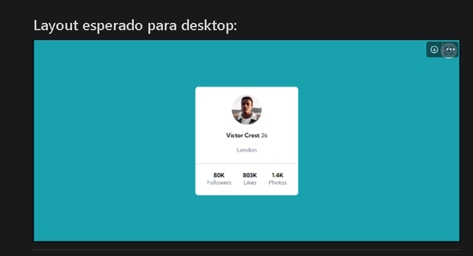

# Projeto Cartão de perfil
A atividade consistia em criar um cartão de perfil como na imagem passada.

 ## Tecnologias utilizadas
-HTML
-CSS

## Estrutura do projeto:
A pasta src, contendo as pastas css e imagens do projeto.

